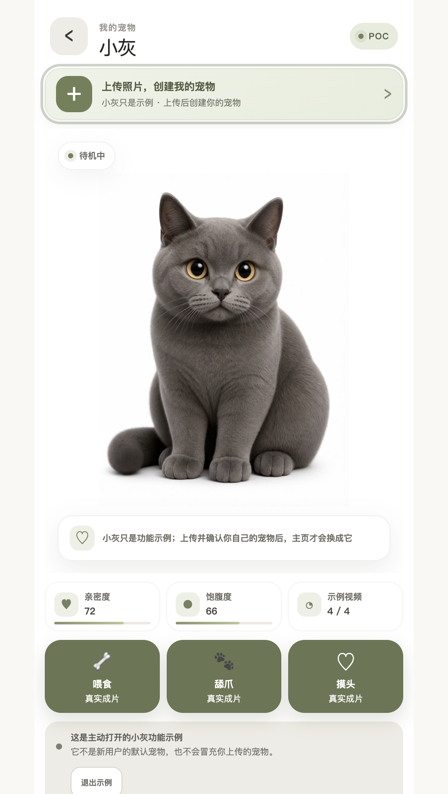

# 小爪星球 · 宠物互动 POC

上传一张宠物照片，先生成并确认一张卡通宠物母版，再体验固定的互动动作。



## 这是什么

这是一个可运行的产品概念验证（POC），用于验证“小爪星球”的核心流程：

1. 用户上传猫咪或狗狗照片。
2. 系统生成卡通预览，用户确认“像不像”。
3. 确认后进入宠物档案，并体验喂食、舔爪、摸头等动作。

## 当前能体验什么

- 新用户从空白主页开始，不会自动挂载别人的宠物。
- 上传页面提供原图与卡通预览对照，并支持“使用这张”或重新选择。
- 已接入小灰演示和已验收的小橘缓存动作，用于展示完整交互。
- 支持在档案中保存宠物名称、类型、年龄和性别，并预留多宠物切换结构。
- 页面有生成状态、失败提示和刷新后的任务恢复逻辑。

## 本地运行

需要 Node.js 22+。

```bash
npm install
npm run dev
```

然后打开 <http://localhost:3000/>。

常用检查命令：

```bash
npm run lint
npm run build
npm test
```

## 项目结构

```text
app/                 页面与服务端接口
lib/                 宠物档案、任务和视频逻辑
public/assets/       演示图片与视频
workflows/           ComfyUI 工作流、提示词和验收记录
marketing/           产品宣传与 GEO 素材
```

## 重要边界

这是本地 POC，不是已经对外开放的在线生成服务。

- 灰猫和小橘当前主要使用已验收缓存，保证演示稳定。
- 任意新宠物要真正生成卡通母版和四个动作，还需要受保护的 ComfyUI HTTPS 后端、稳定 GPU、任务数据库、对象存储、登录和额度控制。
- 狗狗模板尚未验收，当前不会把狗狗套进猫咪模板。
- `.env.example` 只有占位符。真实 Cookie、Token、云端地址等密钥只能放在本地服务端环境变量中，不能提交到 GitHub。

## 进一步阅读

- [工作流与验收说明](workflows/README.md)
- [GEO 宣传素材](marketing/geo-kit-2026-08-28/交付材料/README.md)
- [发布文件指纹](RELEASE-FINGERPRINT.md)
- [MIT License](LICENSE)

## License

本项目采用 [MIT License](LICENSE)。
